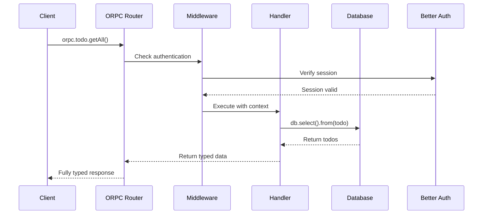

# Quickstart Guide

Get your development environment set up and running in just a few minutes. This guide will walk you through cloning the repository, setting up the database, and running your first authenticated API call.

## Prerequisites

Before you begin, make sure you have the following installed:

- **Node.js 20+**: [Download Node.js](https://nodejs.org)
- **pnpm**: Fast, disk space efficient package manager

<CodeGroup>
```bash npm
npm install -g pnpm
```

```bash brew
brew install pnpm
```

```bash curl
curl -fsSL https://get.pnpm.io/install.sh | sh -
```
</CodeGroup>

## Installation

<Steps>
  <Step title="Clone the Repository">
    Clone the starter template to your local machine:
    
    ```bash
    git clone <repository-url> my-app
    cd my-app
    ```
  </Step>

  <Step title="Install Dependencies">
    Install all required packages using pnpm:
    
    <CodeGroup>
    ```bash pnpm
    pnpm install
    ```
    
    ```bash npm
    npm install
    ```
    
    ```bash yarn
    yarn install
    ```
    </CodeGroup>
    
    This will install all dependencies including:
    - ORPC packages (`@orpc/server`, `@orpc/client`, `@orpc/tanstack-query`)
    - Better Auth for authentication
    - Drizzle ORM and libsql client
    - Next.js and React
    - UI dependencies (Tailwind CSS, shadcn/ui components)
  </Step>

  <Step title="Set Up Environment Variables">
    Copy the example environment file and configure your variables:
    
    ```bash
    cp .env.example .env
    ```
    
    The default configuration works for local development:
    
    ```bash .env
    NEXT_PUBLIC_SERVER_URL=http://localhost:3000
    DATABASE_URL=file:./local.db
    ```
    
    <Note>
      For production, you'll need to add `BETTER_AUTH_SECRET` and `BETTER_AUTH_URL`. See the [Installation](/installation) guide for details.
    </Note>
  </Step>

  <Step title="Initialize the Database">
    Start the local SQLite database and apply the schema:
    
    ```bash
    # Start the local database in a separate terminal
    pnpm db:local
    ```
    
    In another terminal, push the schema to your database:
    
    ```bash
    pnpm db:push
    ```
    
    This creates the necessary tables for:
    - User authentication (users, sessions, accounts)
    - Todo application (todos table)
    
    <Note>
      The `db:local` command uses Turso's local development server. Keep this terminal running while you develop.
    </Note>
  </Step>

  <Step title="Start the Development Server">
    Launch the Next.js development server with Turbopack:
    
    ```bash
    pnpm dev
    ```
    
    Your application will be available at [http://localhost:3000](http://localhost:3000)
    
    <Note>
      The development server uses Turbopack for fast hot module replacement (HMR).
    </Note>
  </Step>
</Steps>

## Verify Your Setup

Let's make sure everything is working correctly:

<Steps>
  <Step title="Test the Application">
    Open your browser and navigate to [http://localhost:3000](http://localhost:3000)
    
    You should see the landing page with navigation to different sections.
  </Step>

  <Step title="Create an Account">
    1. Click on **Sign Up** or navigate to `/login`
    2. Enter an email address and password
    3. Click **Create Account**
    
    Better Auth will:
    - Hash your password securely using bcrypt
    - Create a user record in the database
    - Establish a session with secure cookies
  </Step>

  <Step title="Try Protected Procedures">
    Navigate to the **Dashboard** or `/dashboard` page.
    
    This page calls a protected procedure that requires authentication:
    
    ```typescript src/routers/index.ts
    privateData: protectedProcedure.handler(({ context }) => {
      return {
        message: "This is private",
        user: context.session?.user
      }
    })
    ```
    
    You should see your user information displayed, proving that authentication is working.
  </Step>

  <Step title="Test the Todo Application">
    Navigate to `/todos` and try:
    
    1. **Create a todo**: Enter text and click Add
    2. **Toggle completion**: Click the checkbox
    3. **Delete a todo**: Click the trash icon
    
    All of these operations use ORPC procedures with full type safety:
    
    ```typescript
    // Frontend - fully typed!
    const todos = useQuery(orpc.todo.getAll.queryOptions())
    createMutation.mutate({ text: "New todo" })
    ```
  </Step>
</Steps>

## Understanding the Data Flow

Here's what happens when you call an ORPC procedure:



## Next Steps

<CardGroup cols={2}>
  <Card title="Core Concepts" icon="book" href="/core/authentication">
    Learn how ORPC procedures and Better Auth work together
  </Card>
  
  <Card title="API Reference" icon="code" href="/api/overview">
    Explore all available procedures and their types
  </Card>
  
  <Card title="Database Schema" icon="database" href="/guides/database-setup">
    Understand the database structure and migrations
  </Card>
  
  <Card title="Deployment" icon="rocket" href="/guides/deployment">
    Deploy your application to production
  </Card>
</CardGroup>

## Common Issues

<AccordionGroup>
  <Accordion title="Port 3000 already in use">
    If port 3000 is already in use, you can change it in `package.json`:
    
    ```json
    {
      "scripts": {
        "dev": "next dev --turbopack --port 3001"
      }
    }
    ```
    
    Don't forget to update `NEXT_PUBLIC_SERVER_URL` in your `.env` file.
  </Accordion>
  
  <Accordion title="Database connection errors">
    Make sure:
    1. The `db:local` command is running in a separate terminal
    2. The `DATABASE_URL` in `.env` matches the database location
    3. You've run `pnpm db:push` to create the tables
  </Accordion>
  
  <Accordion title="Type errors in the client">
    If you see TypeScript errors when calling ORPC procedures:
    1. Restart your TypeScript server in your editor
    2. Make sure your imports match the router structure
    3. Check that `AppRouter` type is exported from `src/routers/index.ts`
  </Accordion>
  
  <Accordion title="Authentication not persisting">
    Better Auth uses HTTP-only cookies for sessions. Make sure:
    1. You're not blocking cookies in your browser
    2. The `credentials: "include"` option is set in the fetch configuration (already configured in the template)
    3. Your `NEXT_PUBLIC_SERVER_URL` matches the URL you're accessing
  </Accordion>
</AccordionGroup>

## Development Tips

- **Hot Reload**: Changes to your ORPC router automatically update types in your client code
- **Database Studio**: Run `pnpm db:studio` to open Drizzle Studio and inspect your database
- **React Query DevTools**: The template includes React Query DevTools - look for the icon in the bottom corner
- **Type Checking**: Run `pnpm typecheck` to check for TypeScript errors across your project
- **Linting**: Run `pnpm lint` to check code quality with Biome

## Ready to Build

You now have a fully functional type-safe API with authentication! Start building your features by:

1. Adding new procedures to your ORPC routers
2. Creating new database tables in `src/db/schema`
3. Building UI components with shadcn/ui
4. Implementing your business logic

All with full type safety from database to UI.
